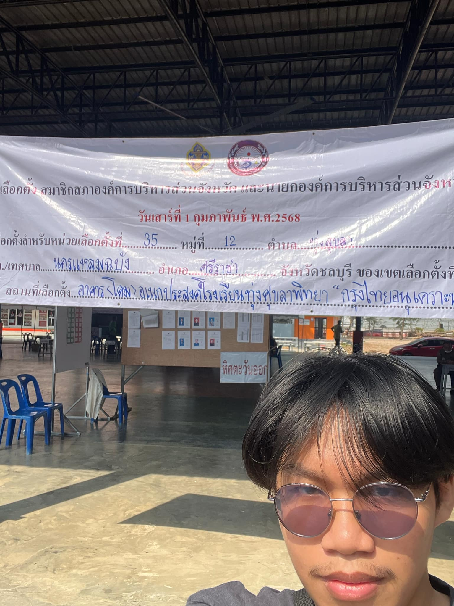

# 2025 PAO Elections

## การเลือกตั้ง สมาชิกสภาองค์การบริหารส่วนจังหวัด และนายกองค์การบริหารส่วนจังหวัดชลบุรี
การเลือกตั้งอบจ.ชลบุรี (องค์การบริหารส่วนจังหวัดชลบุรี) คือการเลือกตั้งผู้บริหารและสมาชิกขององค์การบริหารส่วนจังหวัด (อบจ.) ในจังหวัดชลบุรี ซึ่งอบจ.เป็นองค์กรปกครองส่วนท้องถิ่นที่มีหน้าที่ดูแลการพัฒนาและการบริการต่าง ๆ ภายในจังหวัด เช่น การพัฒนาโครงสร้างพื้นฐาน การศึกษา การสุขภาพ และบริการอื่น ๆ ที่เกี่ยวข้องกับชุมชนในพื้นที่

การเลือกตั้งอบจ.จะเกิดขึ้นทุก ๆ 4 ปี โดยผู้มีสิทธิเลือกตั้งจะเลือกผู้บริหารอบจ. (นายกอบจ.) และสมาชิกอบจ. (สมาชิกสภาอบจ.) เพื่อมาดำเนินงานในเรื่องต่าง ๆ ที่เกี่ยวข้องกับการพัฒนาในพื้นที่นั้น ๆ

การเลือกตั้งดังกล่าวจะมีการใช้สิทธิเลือกตั้งโดยประชาชนที่มีอายุ 18 ปีขึ้นไป และมีชื่ออยู่ในทะเบียนราษฎร์
สถานที่เลือกตั้ง : ตำบลทุ่งสุขลา อำเภอศรีราชา จังหวัดชลบุรี
### วันเสาร์ที่ 1 กุมภาพันธ์ พ.ศ.2568

นาย ชลสิทธิ์ กิจกุลพิเชฐ 6530200088

### Check in โรงเรียนทุ่งศุขลาพิทยา กรุงไทยอนุเคราะห์

