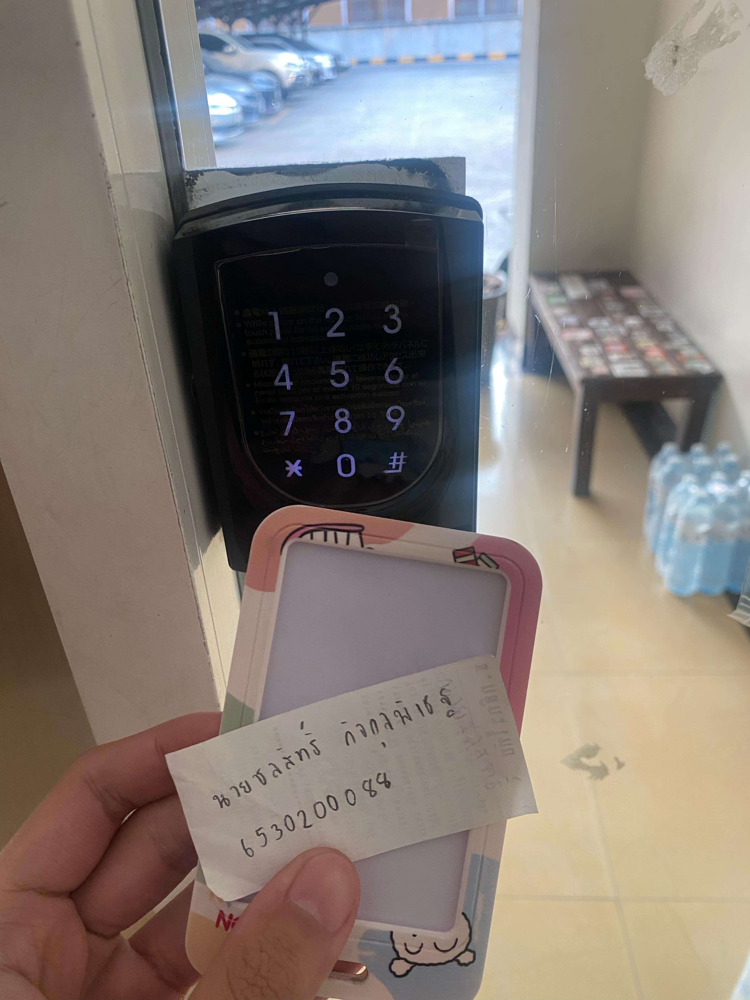

Example of Security Controls in Daily Life
Digital Door Lock (กลอนประตูดิจิตอล)
สถานที่ : หอสุขสบาย ตำบลทุ่งสุขลา อำเภอศรีราชา ชลบุรี 20230

image(รูป)

Types of Security Controls: Physical Controls กลอนประตูดิจิทัลเป็นการควบคุมทางกายภาพที่สามารถสัมผัสได้จริงและเน้นการปกป้องทรัพย์สิน พร้อมทั้งเพิ่มความสะดวกสบายให้กับผู้ใช้งาน อีกทั้งยังช่วยลดความเสี่ยงจากการใช้กุญแจแบบเก่าที่อาจสูญหาย

Control Functions: Preventative กลอนประตูดิจิทัลยังทำหน้าที่เป็นมาตรการป้องกัน โดยช่วยกั้นไม่ให้บุคคลที่ไม่ได้รับอนุญาตเข้าถึงพื้นที่ที่ต้องการความปลอดภัย ผ่านการใช้รหัสผ่านหรือระบบล็อกอิเล็กทรอนิกส์ที่ผู้ใช้งานสามารถตั้งค่าได้เอง ซึ่งช่วยลดความเสี่ยงในการละเมิดความปลอดภัยและเพิ่มความมั่นใจว่าพื้นที่นั้นจะปลอดภัย

ดังนั้น : กลอนประตูดิจิทัลเป็นการควบคุมทางกายภาพและเชิงป้องกันที่ช่วยป้องกันการเข้าถึงโดยไม่ได้รับอนุญาตผ่านระบบรหัสที่ปลอดภัยและใช้งานง่าย

นาย ชลสิทธิ์ กิจกุลพิเชฐ 6530200088

